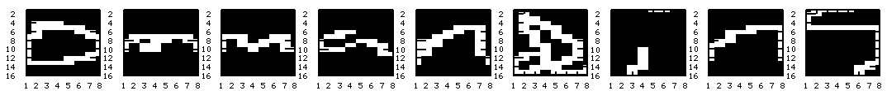
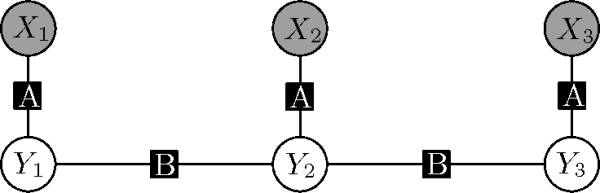

C++ Example: Optical Character Recognition
------------------------------------------

In this example, we are going to reproduce an experiment from [Taskar2003]_.
The test-time task is optical character recognition (OCR) in which we are
provided a sequence of characters to be recognized as one word.  For each
character a small 8-by-16 pixel image with binary values is available.
Additionally, at training time we are provided for each character a ground
truth character label taking one of 26 discrete values between "a\" and "z\".

The figure below illustrates the problem by showing the sequence of images.
The word to be recognized is "Commanding\".  For simplicity all capitalized
characters are removed from the data set and therefore the artifical word to
be recognized is now "ommanding\".

We are going to learn a linear chain discrete-state conditional random field,
as introduced by [Lafferty2001]_.  The structure of the model is shown in the
next figure.

Each observed variable :math:`X_i` takes as value an 8-by-16 binary image,
whereas each random variable :math:`Y_i` to be infered takes discrete values
from the set :math:`\{0,1,\dots,25\}` encoding the 26 lowercase latin
characters.

Because some character combinations are more likely than others, we will
define pairwise factors between each two adjacent :math:`Y_i` character
variables.  This is a simple first-order language model.  The factor type

Taken together, the two factor types and the model structure, as well as the
observed data define a family of distributions over all variables :math:`Y_i`.
Training consists of finding a single member of this family, indexed by the
weight vector associated to the two factor types.

Code: Setting up the factor types
---------------------------------

First we create the factor type "A\" shown in the above Figure.  In the code
we name the factor "factor_unary\".

.. code-block:: cpp

	// Create one unary factor type: letter 'a'-'z'
	std::vector<unsigned int> card(1, 26);
	std::vector<double> w(26*16*8, 0.0);
	Grante::FactorType* ft = new Grante::FactorType("letter_unary", card, w);
	model.AddFactorType(ft);

The pairwise factor has as parameters a simple 26-by-26 energy table.  It does
not depend on any additional features.

.. code-block:: cpp

	// Create the pairwise factor
	std::vector<unsigned int> card_pw(2, 26);
	std::vector<double> w_pw(26*26, 0.0);
	Grante::FactorType* ft_pw = new Grante::FactorType("pairwise", card_pw, w_pw);
	model.AddFactorType(ft_pw);

Code: Training by Maximum Likelihood Estimation
-----------------------------------------------

To create a set of training instances we have to setup a factor graph
instantiating the factor types and create an observation using the
"labeled_instance_type\" as follows.

.. code-block:: cpp

	// Read in training data
	std::vector<Grante::ParameterEstimationMethod::labeled_instance_type>
		training_data;
	std::vector<Grante::InferenceMethod*> inf_method;

	// ... (Load text file with data)

	// Add sample
	std::vector<unsigned int> fg_varcard(word.length(), 26);
	Grante::FactorGraph* fg = new Grante::FactorGraph(&model, fg_varcard);

	// Add unary observation factors
	for (unsigned int ci = 0; ci < word.length(); ++ci) {
		std::vector<unsigned int> factor_varindex(1, ci);
		Grante::Factor* fac = new Grante::Factor(pt, factor_varindex, data[ci]);
		fg->AddFactor(fac);
		if (ci == 0)	// Add pairwise factor to the left?
			continue;	// No

		// Add pairwise factor between (ci-1) and (ci)
		std::vector<unsigned int> fac_pw_varindex(2);
		fac_pw_varindex[0] = ci-1;
		fac_pw_varindex[1] = ci;
		std::vector<double> data_pw_empty;
		Grante::Factor* fac_pw =
			new Grante::Factor(pt_pw, fac_pw_varindex, data_pw_empty);
		fg->AddFactor(fac_pw);
	}

	// Compute ground truth label
	std::vector<unsigned int> fg_label(word.length(), 0);
	for (unsigned int wi = 0; wi < word.length(); ++wi)
		fg_label[wi] = word[wi] - 'a';	// [0-25]

	// Add observation
	Grante::ParameterEstimationMethod::labeled_instance_type lit(fg,
		new Grante::FactorGraphObservation(fg_label));
	training_data.push_back(lit);

	// Add inference method: here its a chain, hence use the tree inference
	// method
	inf_method.push_back(new Grante::TreeInference(fg));

	// Train the model using regularized maximum likelihood estimation
	Grante::MaximumLikelihood mle(&model);
	mle.SetupTrainingData(training_data, inference_methods);
	mle.AddPrior("letter_unary", new Grante::NormalPrior(1.0, w.size()));
	mle.AddPrior("pairwise", new Grante::NormalPrior(1.0, w_pw.size()));
	mle.Train(1.0e-4);
	std::cout << "Finished training." << std::endl;

The model is set up now, and we have one or multiple training instances.  In
this case, each instance has its own factor graph model, but if the graph
structure is fixed, such as when all words are of the same length, you can use
one factor graph model.  Also, in our OCR model the factor graph is a chain,
hence is tree-structured, and we can use the efficient tree inference class to
perform probabilistic inference.

The actual training is performed using numerical optimization, in this case
the negative conditional log-likelihood of the observations under the model is
optimized until the gradient norm is below a given threshold.  The parameters
in the factor types are adjusted.  The prior distributions on parameters are
set to be multivariate Normal distributions.  Because no posterior
distribution over the parameters is maintained (as in Bayesian inference), we
perform point estimation only.

Code: Test-time inference
-------------------------

Grante supports a large number of inference methods, which can be grouped into
probabilistic inference methods and maximum aposteriori (MAP) inference
methods.  The probabilistic methods return (approximate) marginal
distributions for each factor in the model and in some cases an estimate of
the log partition function of the distribution.

The MAP inference methods try to find the discrete state that has maximum
probability, or, equivalently, the minimum energy.

In the C++ example we perform MAP inference as follows.

.. code-block:: cpp

	for (unsigned int n = 0; n < test_data.size(); ++n) {
		// Perform MAP prediction
		Grante::TreeInference tinf(test_data[n].first);	// fg
		test_data[n].first->ForwardMap();	// update energies
		std::vector<unsigned int> map_state;
		tinf.MinimizeEnergy(map_state);

		// ...
	}

