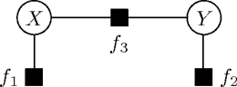

Factor graphs
=============

*Factor graphs* [Kschischang2001]_ are a compact and versatile representation
for family of probability distributions.  Within the Grante library, we only
consider probability distributions over finite sets represented by factor
graphs.  Therefore, we are restricted to the use of discrete random variables.

Popular classes of *graphical models* such as *Bayesian networks* (directed
graphical models), *Markov random fields* (Markov networks, undirected
graphical models, conditional random fields), and *chain graphs* can all be
represented as factor graphs.  Infact, factor graphs are universal and every
probability distribution over a finite set can be represented.

The figure above shows an example of a factor graph defining a family of
distributions :math:`p(X,Y)` over a pair :math:`(X,Y)` of discrete random
variables.  Variables such as :math:`X` and :math:`Y` are represented in a
factor graph by means of *variable nodes* dawn as circles.
Three additional *factor nodes*, :math:`f_1`, :math:`f_2`, and :math:`f_3`,
are drawn as squared boxes.  Factor nodes connect to one or more variable
nodes.
In some branches of the literature factor functions are called *potential
functions* or simply *potentials*.
In a factor graph, all edges are between exactly one factor node and one
variable node, therefore the graph is said to be *bipartite*.

The factor nodes describe interactions between random variables such that the
overall probability distribution :math:`p(X,Y)` is defined as a factorization
over non-negative factor functions, each taking as arguments the value of
their adjacent variables as follows.

.. math::
	p(X=x,Y=y)=\frac{1}{Z} \cdot f_1(x) \cdot f_2(y) \cdot f_3(x,y).

The constant :math:`Z` normalizes the distribution.  Because each factor
function is non-negative, i.e. :math:`f_1(x) \geq 0`, :math:`f_2(y) \geq 0`,
and :math:`f_3(x,y) \geq 0`, we have

.. math::
	Z = \sum_{x \in \mathcal{X}} \sum_{y \in \mathcal{Y}}
	f_1(x) \cdot f_2(y) \cdot f_3(x,y),

where :math:`\mathcal{X}` and :math:`\mathcal{Y}` are the *domains* of the
variables :math:`X` and :math:`Y`, respectively.  If we assume the domains and
factor functions as given, then the distribution is well defined as long as at
least one configuration :math:`(x,y) \in \mathcal{X}\times\mathcal{Y}` has a
non-zero product.  In order to ensure this, we consider a slight restriction
of possible factor functions that we now define.

Factors, Potentials and Energies
--------------------------------

For a factor function :math:`f` that has the set of adjacent variable nodes
:math:`S_f=\{X_1,X_2,\dots,X_k\}` we define the *product variable domain*
:math:`\mathcal{D}(S_f)=\mathcal{X}_1\times\mathcal{X}_2\times\dots\times\mathcal{X}_k`
and the *product variable state* :math:`x_f=(x_1,x_2,\dots,x_k) \in \mathcal{D}(S_f)`.

We assume all factor functions :math:`f:\mathcal{D}(S_f)\to\mathbb{R}_+` are given
in the following form.

.. math::
	f(x_1,x_2,\dots,x_k) = \exp\{-E_f(x_1,x_2,\dots,x_k)\},

where :math:`E:\mathcal{D}(S) \to \mathbb{R}` is the **energy function**
associated to that factor.  Because each factor function is now strictly
positive, we have also

.. math::
	E_f(x_1,x_2,\dots,x_k) = -\log f(x_1,x_2,\dots,x_k),

so the energies are also said to be the *negative log-potential functions* and
are signed.
Assigning a high energy value to a certain variable configuration leads to a
low probability assigned to this configuration, whereas assigning a low energy
makes the configuration more likely.

In the Grante library we will almost always work with energies instead of
factors.  We will explain later that this is especially useful in the context
of parameter learning, but first a little more on energies.

Energy tables
-------------

Each factor node has associated with it a potential function defined through
energies.  For the discrete models we are interested in, the energies can be
best thought as a multi-dimensional array or table associated to each factor.
In this table each dimension corresponds to one adjacent variable of the
factor.

For a given overall variable state :math:`x`, computing the overall energy
:math:`E(x)` is then simply a summation over all factors of the model.  For
each factor, a table-lookup is performed, selecting exactly one energy value
from each table as follows.

.. math::
	E(x) = \sum_{f \in F} E_f(x_f),

where :math:`F` is the set of all factors :math:`f` of the model.
The logarithm of the probability distribution :math:`p(x)` defined by the
factor graph is given as

.. math::
	\log p(x) = \log \frac{1}{Z} \exp\{-E(x)\}
	= -E(x) - \log Z.

Where do the energy values come from?
-------------------------------------

In the Grante library the energies we can be directly specified.  This is
often used in case for a given model good prior knowledge exists.  For
example, if one binary variable encodes the predicate 'Bob has just eaten' and
another variable encodes the predicate 'Bob is hungry' then we now that it is
unlikely both predicates are true at the same time.  We therefore could add a
factor between the two variables and assign a high energy value to that
particular cell in the table.

More often than not, such accurate prior knowledge is not available.  Instead,
the model builder would like to *learn* suitable energies from observational
data.  The primary goal of the Grante library is to enable parameter learning
for discrete models specified factor graphs.  In the next section we discuss
in detail how to pose the parameter learning problem.

