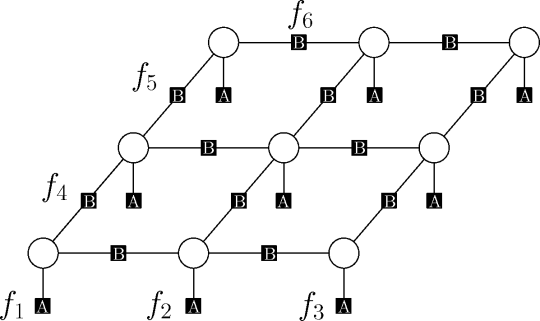
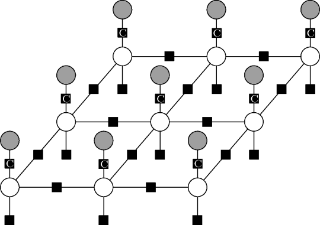
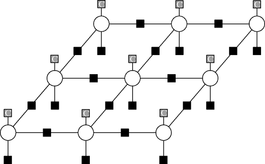

.. _factor_types:

Factor types
============

Factor types are the most important concept to understand within the Grante
library.  In the library, each factor in the factor graph *instantiates* one
so called *factor type*.  A factor type usually describes a factor of the
model that is repeated many times.  To this end each factor type provides the
following information:

* The number of adjacent variables and cardinalities of their domains,
* (optional) Parameters associated with this factor type, and
* (optional) a mechanism to relate energies to parameters.

To better understand the above properties, consider as an example the
following factor graph model popularly used in computer vision.  The model is
defined over nine variables as follows.

There are a total of 21 factors in the graph: nine *unary factors* with one
adjacent variables each, and twelve *pairwise factors* with two adjacent
variables.

Each factor could have its own energy table, but often we simply replicate an
energy table multiple times within the model.  This is where factor types are
useful.  In the above model we use two factor types: "A" for the unaries and
"B" for the pairwise factors.  Each factor has its type written in white
letters within the square factor node.  Therefore, in the above model all
unary factors instantiate type "A" and all pairwise factors instantiate type
"B".  Suppose we would like to make all factors of type "B" have the same
energies, whereas all factors of type "A" should have their own,
factor-specific energies.  To realize this, we consider different uses of
factor types.

Factor type use cases
---------------------
In order to define a probability distribution each factor in the factor graph
requires to know its energy values.  These values depend on the factor data
and the parameters associated to the instantiated factor type.
The purpose of factor types is therefore to allow computation of energy values
for each factor from factor-type-specific parameters and factor-specific data.

The following three use cases cover the most popular modeling situations.

1. Replicating energies.
	The factor type contains as parameter vector
	:math:`w \in \mathbb{R}^{\mathcal{D}(S_f)}` the table of energies.
	Whenever a factor of this type is instantiated, the energies of the factor
	type are used.  The parameters (energy values) can be learned.  This is
	what we would use for factor type "B" in the above example.

	.. image:: figures/33factorgraph-B.png

	For any factor :math:`f` of this type, the energy is computed as follows.

	.. math::
		E_f(x_f) = w(x_f).

2. Factor-specific energies.
	Each factor :math:`f` has its own energy table :math:`H_f`.  The factor
	type is parameter-free and no parameters can be learned.  This is what we
	would use for factor type "A" in the above example.

	.. image:: figures/33factorgraph-A.png

	For a factor :math:`f` the data vector
	:math:`H_f \in \mathbb{R}^{\mathcal{D}(S_f)}` directly provides the energy
	as follows.

	.. math::
		E_f(x_f) = H_f(x_f).

	The factor type has an empty parameter vector.

3. Data-dependent factor-specific energies.
	The factor type contains parameters :math:`w` which are combined with
	factor-dependent data :math:`H_f` to yield factor-specific energies.  The
	parameters :math:`w` in the factor-type can be learned and apply to all
	factors of its type.

	.. image:: figures/data-dep-factor.png

	One could imagine many possibilities how the factor data and parameters
	can be combined to obtain energies.  In the Grante library, we assume a
	linear relationship as follows.
	For a factor :math:`f` with data vector :math:`H_f \in \mathbb{R}^m` the energy
	for a single configuration :math:`x_f \in \mathcal{D}(S_f)` is obtained
	as:

	.. math::
		E_f(x_f) = \langle w(x_f), H_f\rangle,

	that is, the inner product of the factor data :math:`H_f` and the weight
	vector :math:`w(x_f)` is used to determine the energy :math:`E_f(x_f)`.

	Therefore, in total the factor type has :math:`|\mathcal{D}(S_f)|\cdot m`
	parameters, one :math:`w(x_f) \in \mathbb{R}^m` vector for each possible
	configuration :math:`x_f \in \mathcal{D}(S_f)`.

We have not mentioned the last case, the data-dependent factor-specific
energies, before.  Let me fix that.

Data-dependent factors
----------------------

Introducing data-dependency into parameter learning allows for richer models
and improved prediction performance.  The most common way data-dependent
factors arise is through *conditioning* in learning conditional random fields.

*Conditional random fields* (CRF) [Lafferty2001]_ employ undirected graphical
models to specify a *conditional* probability distribution :math:`p(Y|X=x)`,
given an observation :math:`X=x`.  Within factor graphs observed quantities
such as :math:`X` are usually drawn as shaded variables.  Suppose we would
like to extend the above factor graph with observation data as follows.

The factor type "C" is data-dependent in the following sense: in a CRF, at all
times the distribution of interest is conditioned on the observations.  Thus
the factor depends on the observation, and the observation is the data.  What
this means in practise for factor graphs is that the above graph can be
represented equivalently as the following factor graph.

Here we removed all observation variables.  The factors that had adjacent
observed variables are now acting only on the dependent variables, as before.
Yet, we shaded the factor nodes to indicate that these factors depend on the
observation data.

Both types of representations are meaningful: the first one is used in
modeling interactions between observed quantities and dependent variables.
The second one is all that is ever needed for inference and parameter learning
in the model.

